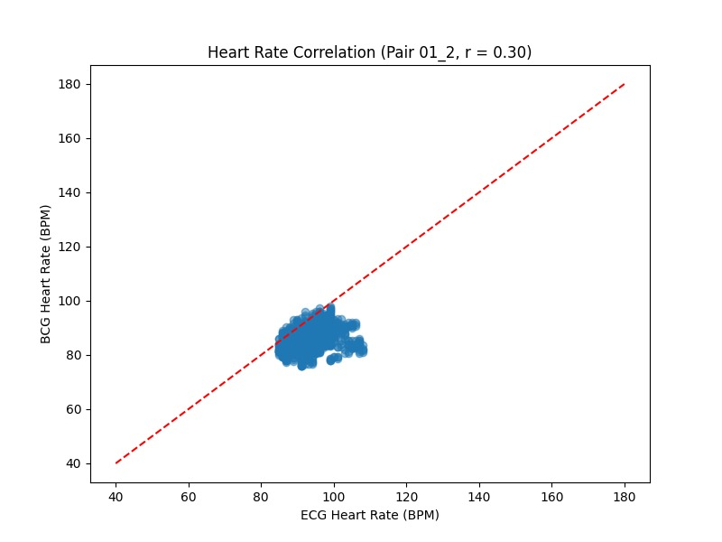
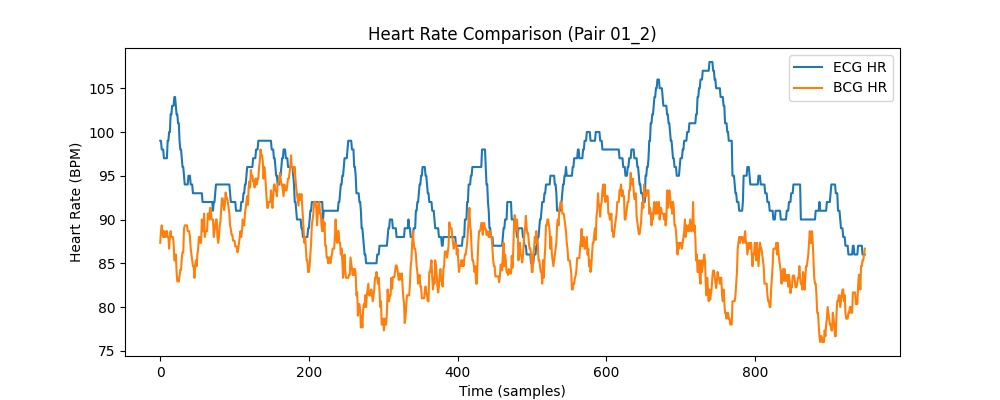
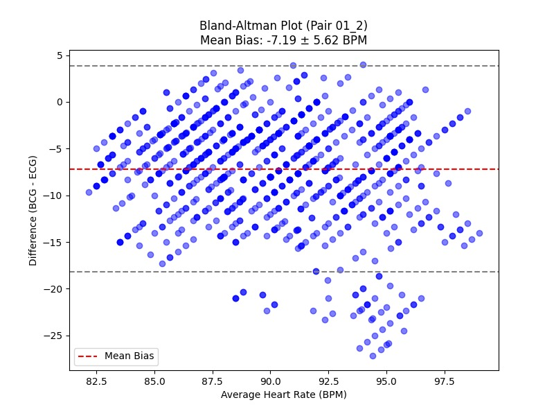
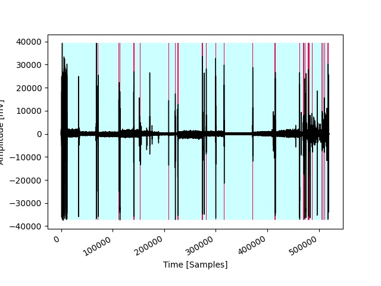

### How to Run

1. **Prepare Input**:
   - Download the folder that contain the zip file from [this link]([http://drive.google.com/file/d/1guxbAVRs1ylf16IMyicyoOFUjJa5u9yp/view](https://drive.google.com/drive/folders/1kmL-8gnwagHmpwxwkAsEgvYLHTrQVFuT?usp=sharing)) and place it in a directory (e.g., `C:\Users\omara\Downloads\01`).
   - Note that the idea of our program depend on uploading a folder that contain zip file of patient sample don't download the content of zip file use the directory of the folder that has the zip file (e.g., `C:\Users\omara\Downloads\01`) where 01 is a folder contain file named 01.zip.
   - Zip should contain:
     - BCG files in a `BCG/` subdirectory (e.g., `01_20231105_BCG.csv`).
     - ECG (RR) files in a `Reference/RR/` subdirectory (e.g., `01_20231105_RR.csv`).
   - Filenames include a date (e.g., `20231105`) for pairing.

2. **Set Directories**:
   - Update `zip_dir` in the script to your zip file directory.
   - Update `results_base_dir` to where you want results saved (e.g., `C:\Users\omara\Downloads\results`).

3. **Run the Script**:
   - Execute the script in a Python environment:
     ```bash
     python finalCodeToTasleem.py
     ```
   - The script will:
     - Extract zip files.
     - Process BCG files (add time vector, resample to 50 Hz).
     - Synchronize BCG and ECG data by time windows.
     - Analyze data and save results.
<table>
  <tr>
    <td></td>
    <td></td>
  </tr>
  <tr>
    <td></td>
    <td></td>
  </tr>
</table>

## Contributors

| Name    | Student ID |
|---------|------------|
| Mostafa Khaled   | 1200272    |
| Maram Tarek    | 1200267    |
| Omar Adel | 4210209    |
| Ahmed Okasha   | 1200843    |

Submitted to Prof. Ibrahim Sadek
